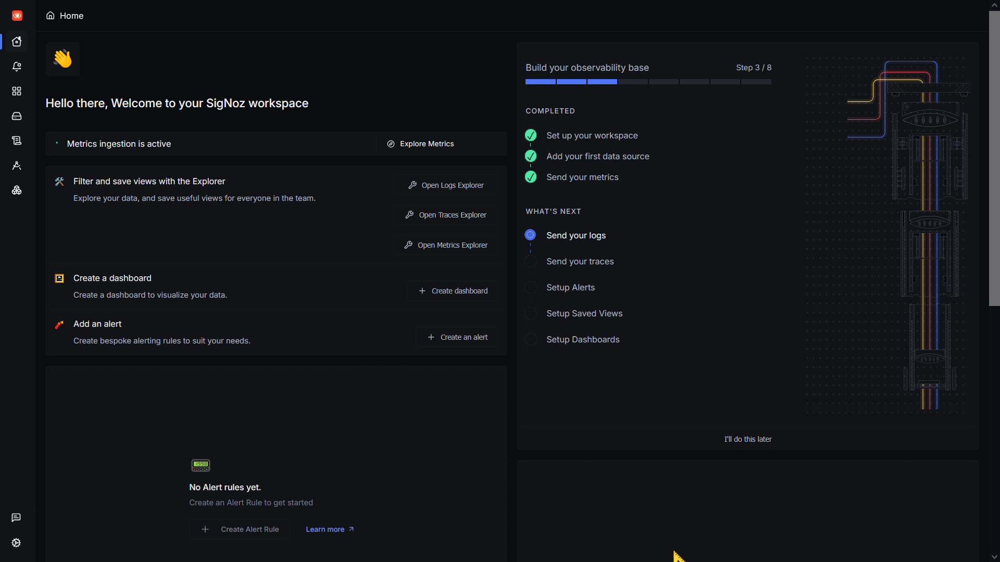
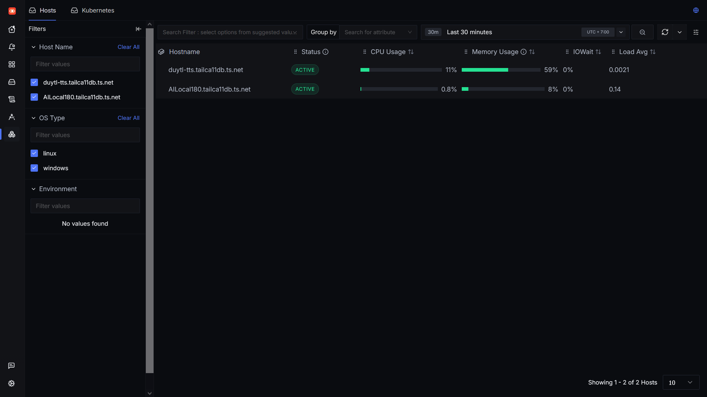
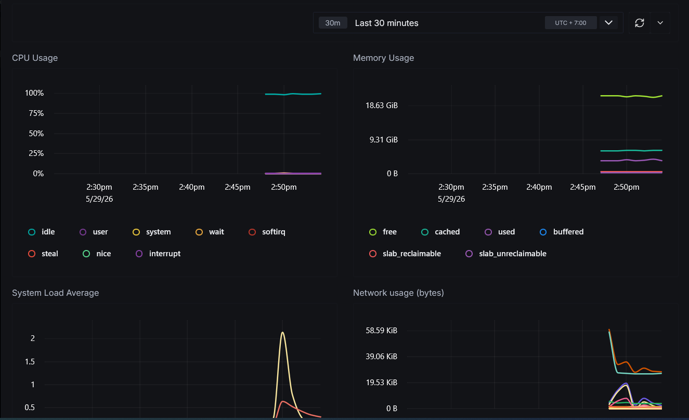

<h1 align="center">Tìm hiểu về SigNoz</h1>

SigNoz là một nền tảng giám sát và phân tích hệ thống mã nguồn mở, sử dụng để theo dõi các ứng dụng, server, container Docker hay K8S, API, hệ thống cloud... SigNoz tích hợp sẵn nhiều chức năng trong hệ thống như giám sát metric và logs, distributed tracing, dashboard và alerting. SigNoz là một giải pháp mã nguồn mở all in one hợp lý để song hành hoặc thay thế những nền tảng monitor khác như Grafana.

Một số tính năng chính của SigNoz:

- Theo dõi hiệu năng ứng dụng: thời gian phản hổi API, error rate, query database, API call...

- Theo dõi metric hệ thống: CPU, memory, disk, network...

- Thu thập, tìm kiếm logs từ ứng dụng hay hệ thống, lọc theo service hay security.

- Xây dựng dashboard, mô hình và sơ đồ hóa metric.

- Distributed tracing: theo dõi một request đi qua nhiều service. VD: User -> API gateway -> Auth service -> Service thanh toán -> Database. SigNoz cho biết chỗ nào bị chậm, bị lỗi, tổng thời gian xử lý request, bị nghẽn ở đâu...

- Alerting: tạo alert rule cho các metric, gửi alert qua nhiều kênh như email hay webhook.

- Có thể nhận dữ liệu từ các nền tảng monitoring khác như Prometheus.

Docs: https://signoz.io/docs/introduction/

<h2 align ="center">Triển khai SigNoz</h2>

Có 2 cách để triển khai SigNoz: sử dụng dịch vụ SigNoz Cloud do SigNoz cung cấp (trả phí, có free trial) hoặc thực hiện self host để chạy SigNoz local (free, mã nguồn mở, sẽ sử dụng phương án này). Để self host SigNoz có 2 cách chính là chạy trực tiếp trong hệ thống Linux hoặc chạy trong một Docker container. Cả 2 cách này đều yêu cầu hệ điều hành Linux.

Yêu cầu:

- HĐH Linux hoặc MacOS.

- Git

- Port 8080, 4317 và 4318 không xung đột với các ứng dụng khác.

**Cài đặt trong Docker**

Clone repo của SigNoz:

```
git clone -b main https://github.com/SigNoz/signoz.git && cd signoz/deploy/
```

Chạy install script: 

```
./install.sh
```

hoặc chạy bằng docker compose:

```
cd docker
docker compose up -d --remove-orphans
```

Để kiểm tra, chạy docker ps. Kết quả phải tương tự:

```
CONTAINER ID   IMAGE                                        COMMAND                  CREATED          STATUS                    PORTS                                    NAMES
afd3e434e853   signoz/signoz-otel-collector:0.111.24        "/signoz-collector -…"   47 minutes ago   Up 45 minutes             0.0.0.0:4317-4318->4317-4318/tcp         signoz-otel-collector
c0b6e58d3d18   signoz/signoz:0.69.0                         "./query-service --c…"   47 minutes ago   Up 46 minutes (healthy)   8080/tcp                                 signoz-signoz
69431900f6ef   clickhouse/clickhouse-server:24.1.2-alpine   "/entrypoint.sh"         47 minutes ago   Up 47 minutes (healthy)   8123/tcp, 9000/tcp, 9009/tcp             signoz-clickhouse
8b69f876a3c7   signoz/zookeeper:3.7.1                      "/opt/bitnami/script…"   47 minutes ago   Up 47 minutes (healthy)   2181/tcp, 2888/tcp, 3888/tcp, 8080/tcp   signoz-zookeeper-1
```

Dashboard của SigNoz có thể được truy cập ở port 8080. Sau khi tạo tài khoản và đăng nhập sẽ access được dashboard.



SigNoz sử dụng OpenTelemetry để thu thập metric và logs. Có thể cài đặt OpenTelemetry trên hệ thống Linux hay Windows thể thu thập metric của những hệ thống này. Như có thể thấy ở trên, SigNoz có đi kèm một otel collector của riêng nó nhưng nên sử dụng một otel riêng để thu thập metric của hệ thóng.

<h2 align="center">Setup OpenTelemetry</h2>

**Config của OpenTelemetry**

Sau khi cài đặt, config sẽ nằm ở /etc/otelcol-contrib/config.yaml. Config định nghĩa:

- receivers: thu thập dữ liệu từ đâu.

- processors: Cách collector sẽ xử lý, lọc hay bổ sung dữ liệu.

- exporter: collector sẽ gửi dữ liệu đi đâu.

- service pipeline: kết nối receiver -> processor -> exporter

Cụ thể trong config sử dụng để collector lấy dữ liệu của server Linux và gửi tới webhook của SigNoz [config.yaml](/files/config.yaml): (Sử dụng config do docs của SigNoz recommend):

- hostmetrics: sử dụng receiver hostmetric để thực hiện scrape metric của server.

    - collection_interval: chu kì thực hiện scrape data.

    - scrapers: module cụ thể để lấy từng loại metric như CPU, disk, memory...

    - Các tùy chọn mute_process_*_error: true giúp bỏ qua các lỗi không quan trọng khi Collector không có quyền truy cập thông tin của một số process.

- processors: 

    - batch: gom nhiều metric lại trước khi gửi đi để giảm số lượng request và tăng hiệu năng.

    - resourcedetection: detectors: [env, system]: bổ sung một số metadata cho metric. env: lấy thông tin từ biến môi trường. system: lấy thông tin hệ thống như hostname, OS, kiến trúc...

    - VD: host.name=linux01 os.type=linux

- exporters:

    - otlp: endpoint: "http://<ip_address>:4317": gửi metric tới OTLP endpoint được chỉ định. Port 4317 là webhook của SigNoz.

- services:

    - Định nghĩa luồng xử lý metric: Metric -> resourcedetection -> batch -> OTLP export -> SigNoz.

    - Nghĩa là: thu thập metric từ máy chủ, thêm thông tin host và môi trường, gom metric thành batch, gửi tới endpoint ở 4317.

**Note: mở rộng config**

Có thể config chu kì scrape dữ liệu cho các metric khác nhau bằng nhiều receiver hostmetrics:

```
receivers:
  # Receiver for high-frequency metrics (e.g., every 10s)
  hostmetrics/fast:
    collection_interval: 10s
    scrapers:
      cpu: {}
      memory: {}

  # Receiver for low-frequency metrics (e.g., every 1m)
  hostmetrics/slow:
    collection_interval: 60s
    scrapers:
      filesystem: {}
      disk: {}
      network: {}

service:
  pipelines:
    metrics:
      receivers: [hostmetrics/fast, hostmetrics/slow]
      # ... other processors and exporters
```

**Chạy OpenTelemetry trong Linux**

Nên chạy collector trực tiếp trong hệ thống, không nằm trong docker để đảm bảo các metric thu được chính xác nhất có thể. Có thể chạy collector dưới dạng systemd service hoặc chạy binary trực tiếp.

**Cách 1 (systemd service)**

Cài đặt deb package (Debian, Ubuntu)

```
ARCH=$(uname -m | sed 's/x86_64/amd64/g' | sed 's/aarch64/arm64/g')
curl -sSL -O "https://github.com/open-telemetry/opentelemetry-collector-releases/releases/download/v0.139.0/otelcol-contrib_0.139.0_linux_${ARCH}.deb"
sudo dpkg -i otelcol-contrib_0.139.0_linux_${ARCH}.deb
```

hoặc RPM package (Red Hat, CentOS, Fedora)

```
ARCH=$(uname -m | sed 's/x86_64/amd64/g' | sed 's/aarch64/arm64/g')
curl -sSL -O "https://github.com/open-telemetry/opentelemetry-collector-releases/releases/download/v0.139.0/otelcol-contrib_0.139.0_linux_${ARCH}.rpm"
sudo rpm -ivh otelcol-contrib_0.139.0_linux_${ARCH}.rpm
```

Sau khi setup config xong, cần restart service:

```
sudo systemctl restart otelcol-contrib
sudo systemctl status otelcol-contrib
```

**Cách 2 (chạy trực tiếp)**

Tải tarball:

```
ARCH=$(uname -m | sed 's/x86_64/amd64/g' | sed 's/aarch64/arm64/g')
curl -sSL -O "https://github.com/open-telemetry/opentelemetry-collector-releases/releases/download/v0.139.0/otelcol-contrib_0.139.0_linux_${ARCH}.tar.gz"
```

Giải nén:

```
tar -xvf otelcol-contrib_0.139.0_linux_${ARCH}.tar.gz
```

Sau khi setup config: thực hiện chạy collector:

```
./otelcol-contrib --config ./config.yaml &> otelcol-output.log & echo "$!" > otel-pid
```

Kiểm tra status của collector:

```
tail -f otelcol-output.log
```

**Chạy OpenTelemetry trong Windows**

Config sử dụng cho Windows [config.yaml](/files/config-window.yaml). Có thể chạy collector dưới dạng Windows Service hoặc chạy exe trực tiếp.

**Cách 1:**

Setup config, sau đó thực hiện tải và chạy service:

```
Start-Process msiexec -ArgumentList "/i", "https://github.com/open-telemetry/opentelemetry-collector-releases/releases/download/v0.139.0/otelcol-contrib_0.139.0_windows_amd64.msi", "CONFIG=config.yaml" -Wait
```

Để kiếm tra collector có chạy hay ko:

```
Get-EventLog -LogName Application -Source "OpenTelemetry Collector" -Newest 20
```

**Cách 2:**

Tải tarball về:

```
https://github.com/open-telemetry/opentelemetry-collector-releases/releases/download/v0.139.0/otelcol-contrib_0.139.0_windows_amd64.tar.gz"
```

Giải nén, tạo config, sau đó chạy collector:

```
.\otelcol-contrib.exe --config config.yaml
```

**Xác nhận datasource trong SigNoz**

Để kiểm tra xem collector có hoạt động không, vào mục Infrastructure Monitoring trong UI của SigNoz. Nếu thành công, datasource sẽ hiện lên như sau:



Ấn vào data source để xem chi tiết các sơ đồ metric của máy host:

