<h2 align="center">Dashboard</h2>

Dashboard là nơi mà SigNoz tổng hợp và trực quan hóa dữ liệu thành các biểu đồ và bảng điều khiển tùy chỉnh để theo dõi hệ thống. Trong doc của SigNoz có nhiều preset dashboard khác nhau cho nhiều loại use case.

```
https://signoz.io/docs/dashboards/dashboard-templates/overview/
```

Để tạo dashboard, vào mục Dashboard -> New dashboard.

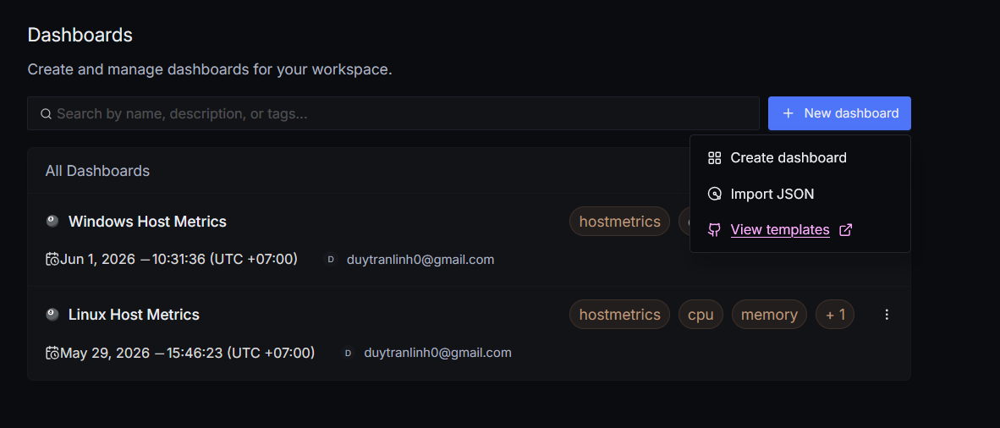

Có thể tạo dashboard thủ công hoặc import từ json. [dashboard.json](files/dashboard.json) là json sử dụng để import dashboard sử dụng cho usecase monitor metric hệ thống.

Hình ảnh dashboard đã tạo: 

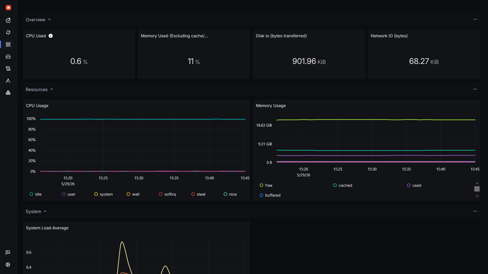

**Một số thành phần trong dashboard:**

- Thanh lọc dữ liệu các panel theo thời gian, refresh dashboard và set chu kì auto-refresh.

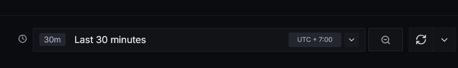

- Biến: các biến do người dùng tạo trong dashboard. Các panel có thể gọi các biến này để sử dụng. Dashboard này sử dụng biến host.name để có thể chuyển qua lại giữa các datasource khác nhau.

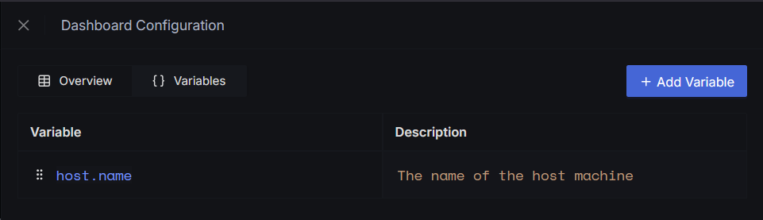

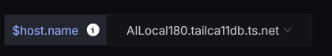

- Panel là thành phần quan trọng nhất trong một dashboard, là nơi thể hiện và mô hình hóa dữ liệu. Trong panel có thể chia thành 3 phần cơ bản: phần biểu đồ, phần query và phần settings.

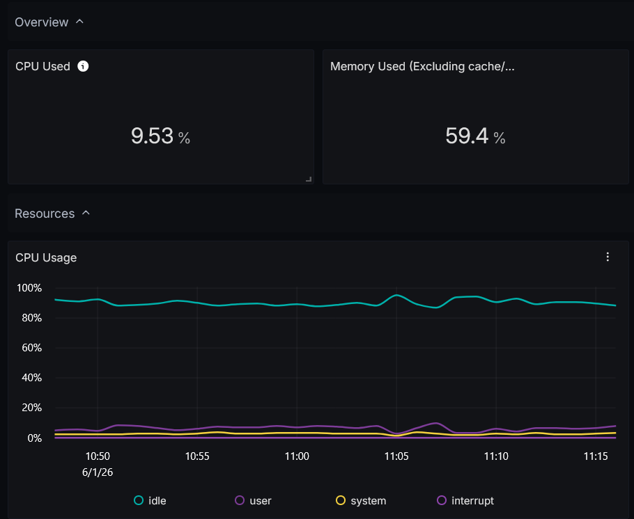

  - Phần biểu đồ là nơi dữ liệu được mô hình hóa, được thể hiện trên màn hình để người dùng có thể theo dõi.

  - Phần query là nơi viết đoạn query để lấy cụ thể và chỉnh sửa những dữ liệu nhận được để có được số liệu mà người dùng cần theo dõi.

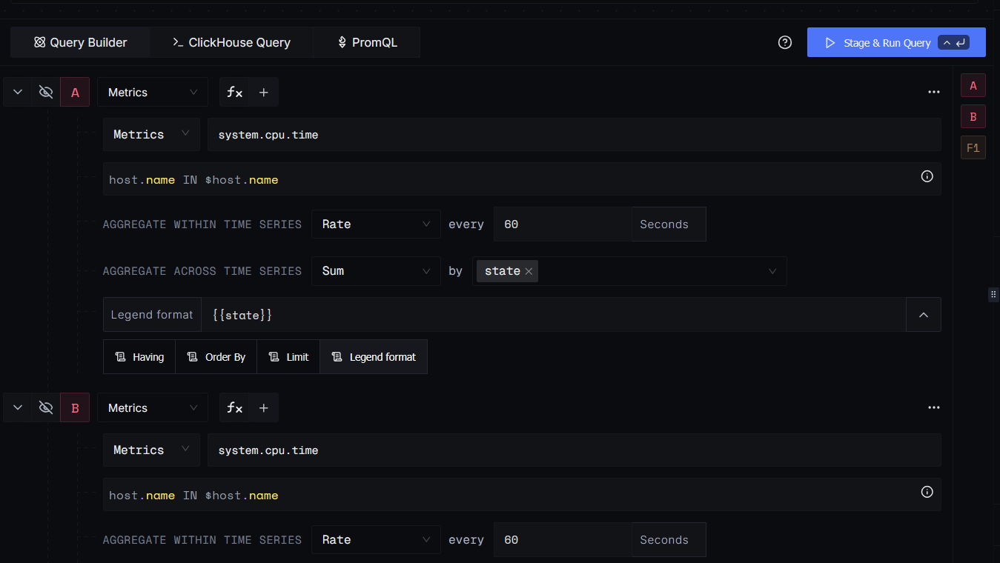

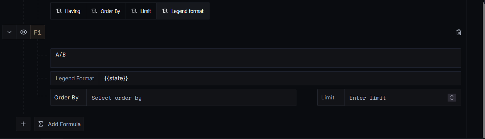

- Trong setting, người dùng có thể chỉnh sửa tên và mô tả của panel, loại panel, đơn vị, trình bày, ngưỡng và alert.

**Trong SigNoz có nhiều loại panel khác nhau:**

- Time series: hiển thị dữ liệu theo thời gian. Loại panel được sử dụng nhiều nhất.

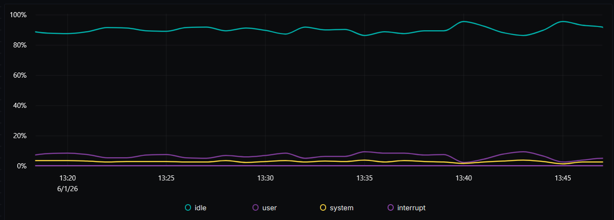

- Number (value): hiển thị một giá trị duy nhất. Phù hợp để lấy số liệu tại thời điểm hiện tại hoặc tổng số của 1 metric nào đó.

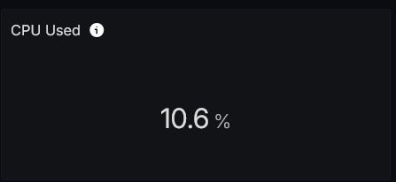

- Table: hiển thị dữ liệu dưới dạng bảng. 

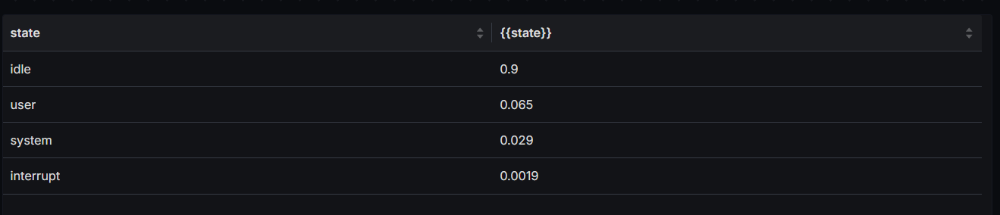

- Bar chart: biểu đồ cột. Phù hợp để theo dõi xem thành phần chiếm bao nhiêu phần trăm tổng thể theo thời gian. 

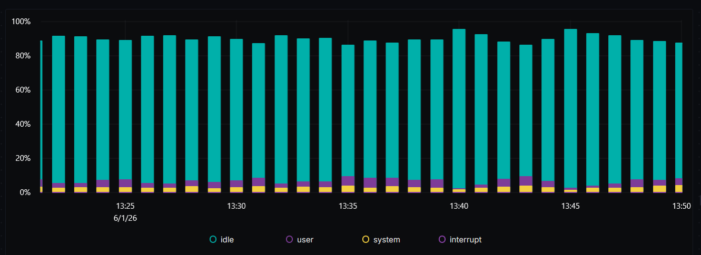

- Pie chart: biểu đồ tròn. Phù hợp để theo dõi xem thành phần chiếm bao nhiêu phần trăm tổng thể tại một thời điểm nhất định hoặc tổng.

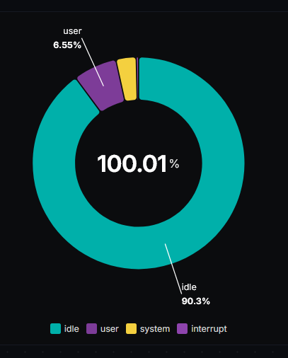

- Histogram: phân bố dữ liệu theo khoảng giá trị. Dùng để theo dõi sự phân bổ của data.

<h2 align="center">Query trong SigNoz</h2>

Query là câu truy vấn dùng để lấy, lọc, tổng hợp và biến đổi dữ liệu để hiển thị trên dashboard hay alert rule. SigNoz hỗ trợ 3 cách query chính là Query Builder, ClickHouse SQL và PromQL (ngôn ngữ query của Prometheus).

<h3 align="center">Query Builder</h3>

Xây dựng Query qua UI thay vì viết code. Có 3 kiểu query khác nhau ứng với 3 loại data cần query: metric query, logs query và trace query. Một query thường có cấu trúc như sau: Biến -> Filter -> Aggregation -> Group by -> Legend Format -> Result Manipulation.

- Biến là dữ liệu cần query. VD: system.cpu.time, system.memory.usage, system.network.io...

- Filter: là bộ lọc để lấy dữ liệu mong muốn. VD: host.name = "server-01" hay (host.name IN $host.name  AND state != 'idle'). Các ký hiệu thường dùng là = (bằng), != (khác), IN (có trong danh sách), NOT IN (ko trong danh sách), LIKE (chứa chuỗi) và EXISTS (tồn tại).

- Aggregation: tổng hợp dữ liệu (tổng, avg, count...)

- Group by: tách dữ liệu theo một hay nhiều đặc điểm khác nhau.

- Legend format: khi sử dụng group by trong time series, mỗi nhóm là một đường khác nhau trong biểu đồ. Legend format sẽ định dạng label của các đường này.

- Result manipulation: sau khi thực hiện aggregation và group by, có thể tiếp tục sàng lọc kết quả:

  - Order by: sort kết quả tăng giảm theo một cột nào đó.

  - Limit: giới hạn số kết quả được trả về.

  - Having: tiếp tục lọc kết quả.

SigNoz cho phép thêm nhiều query trong một cùng một panel, và sử dụng formula để tính toán từ kết quả của các query.

**Metrics Query Builder**

Khác với logs và trace, một metric có thể chứa nhiều time series khác nhau, một time series có thể ứng với 1 combo của nhiều attribute khác nhau như host.name, cpu.state. Vậy nên khi query metric, cần có 2 lớp aggregation kết hợp với nhau là temporal aggregation và spatial aggregation.

Trong SigNoz có 2 loại metric chính là counter (sum) và gauge.

- Counter (sum) là metric mà chỉ tăng theo thời gian. VD: system.cpu.time là thời gian mà mỗi core của CPU dành cho các mode khác nhau, là một con số chỉ tăng lên theo thời gian.

- Gauge là metric có thể tăng giảm. VD: system.cpu.load_average.15m là CPU load trung bình mỗi 15 phút, là một giá trị có thể tăng hoặc giảm theo thời gian tùy theo host.

Aggregation đối với metric gồm 2 bước:

- Temporal aggregation (Tổng hợp theo thời gian): là quá trình tổng hợp dữ liệu trong một khoảng thời gian nhất định trong 1 time series.

- Spatial aggregation (Tổng hợp theo không gian): là quá trình tổng hợp nhiều time series lại với nhau tại một thời điểm sau khi tổng hợp theo thời gian.

Ứng với loại counter, có thể sử dụng kiểu tổng hợp theo thời gian increase và rate còn với loại gauge, có thể sử dụng kiểu tổng hợp theo thời gian latest, sum, avg, min, max, count, count distinct. Cả 2 đều có thể tổng hợp không gian sum, avg, min, max.

VD: (Sử dụng VD của SigNoz)

Đối với gauge:

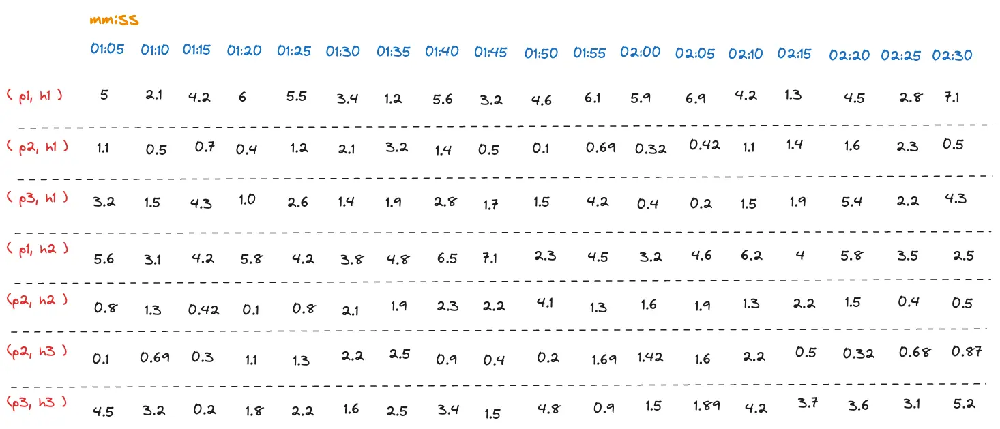

Bảng chứa memory usage qua thời gian (mm:ss) của các process Px chạy trên các host Hx. Ví dụ muốn tìm memory usage của các host thì cần thực hiện:

B1: Tổng hợp theo thời gian: ở mỗi time series, số liệu sẽ được chia thành các nhóm có chu kì 15 giây như sau:

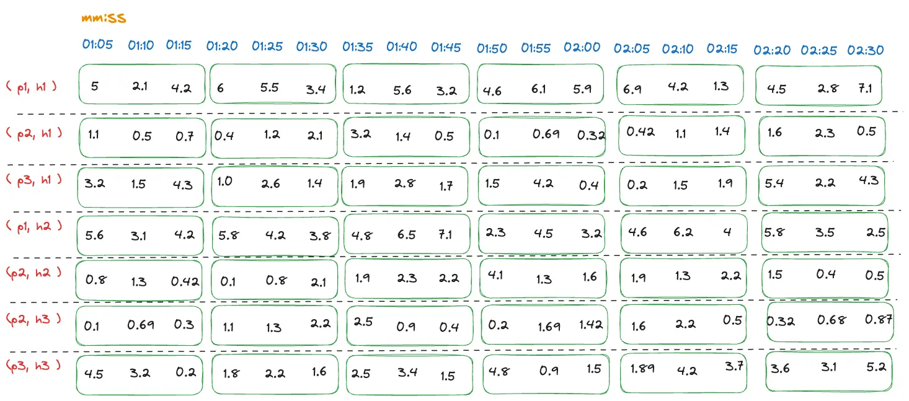

Cần chọn một loại function tổng hợp thời gian phù hợp:

- latest: lấy số liệu mới nhất trong 1 chu kì.

- sum: lấy tổng của các số liệu trong 1 chu kì.

- avg: lấy trung bình các số liệu trong 1 chu kì.

- min: lấy giá trị nhỏ nhất trong 1 chu kì.

- max: lấy giá trị lớn nhất trong 1 chu kì.

- count: đếm lượng số liệu trong 1 chu kì.

- count distinct: đếm lượng số liệu độc nhất trong 1 chu kì.

avg là hợp lý nhất để lấy memory usage trung bình trong 1 interval. Kết quả sử dụng avg:

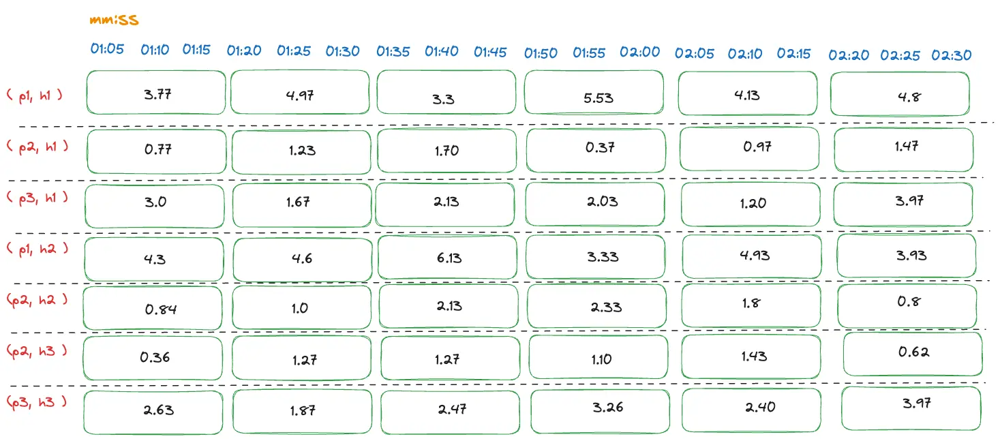

B2: Tổng hợp theo không gian: dữ liệu được tổng hợp từ nhiều time series khác nhau dựa trên những điểm tương đồng giữa chúng. Đề bài yêu cầu tìm memory usage của các host nên có thể nhóm các time series theo host như sau:

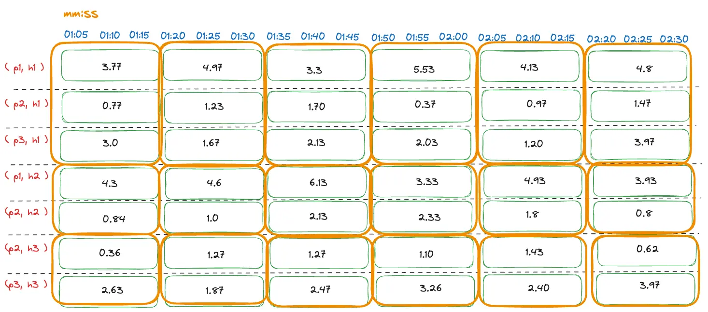

Tương tự, cần chọn một loại function tổng hợp không gian phù hợp:

- sum: lấy tổng của các interval cùng thời điểm giữa các time series.

- avg: lấy trung bình.

- min: lấy giá trị nhỏ nhất

- max: lấy giá trị lớn nhất.

Cần sử dụng sum để lấy tổng memory usage của 1 host khi chạy nhiều process khác nhau. Kết quả:

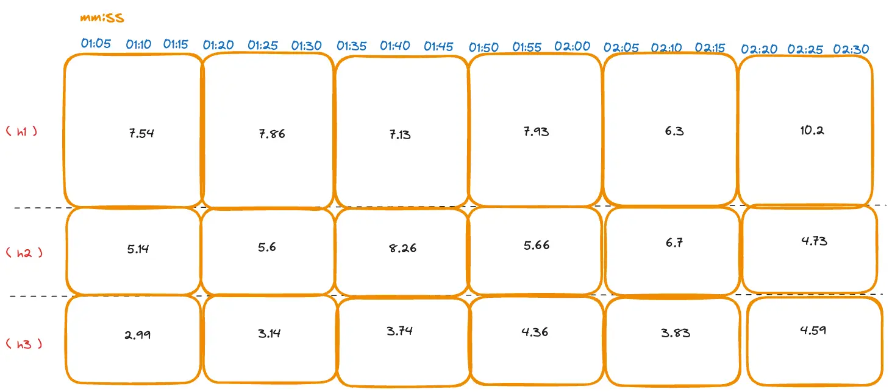

Đối với counter:

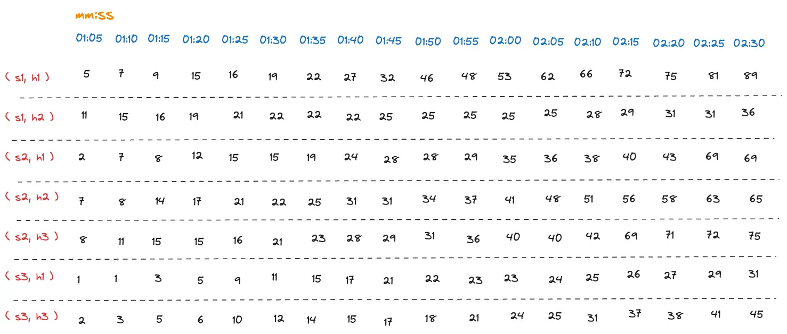

Bảng chứa số lượng request qua thời gian (mm:ss) của các service Sx ở các host Hx. Yêu cầu tìm số lượng request nhận được của từng service tại các interval. Tương tự như trên sẽ chọn interval là 15s.

B1: Tổng hợp thời gian:

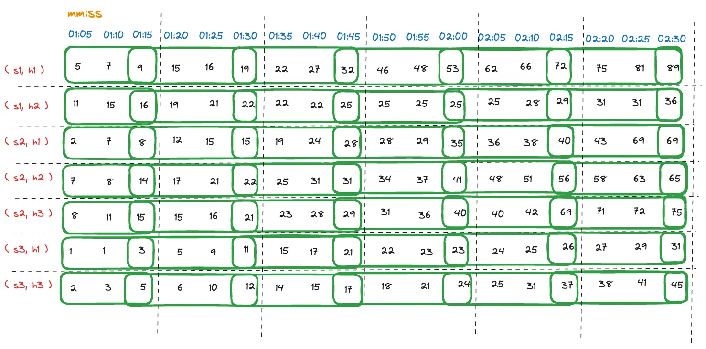

Khác với gauge, counter chỉ có 2 function để tổng hợp thời gian:

- Increase: cho biết số liệu đã tăng bao nhiêu trong 1 interval. Nếu trong 1 interval, số liệu đi từ 2 -> 4 -> 6 thì increase sẽ là 6-2=4.

- Rate: cho biết tốc độ tăng trong 1 interval. VD: trong 15s mà số liệu từ 2 -> 4 -> 6 thì rate sẽ là (6-2)/15

increase hợp lý hơn trong trường hợp này. Sau khi sử dụng function:

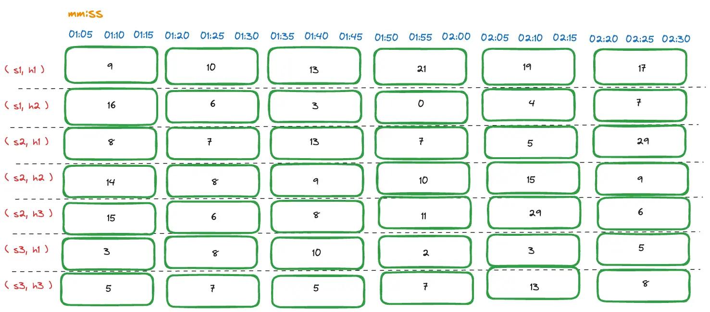

B2: Tổng hợp không gian: giống như với loại gauge, có thể sử dụng các function sum, avg, min, max với loại counter. Do yêu cầu tìm số lượng request nhận được trong 1 interval => sử dụng sum:

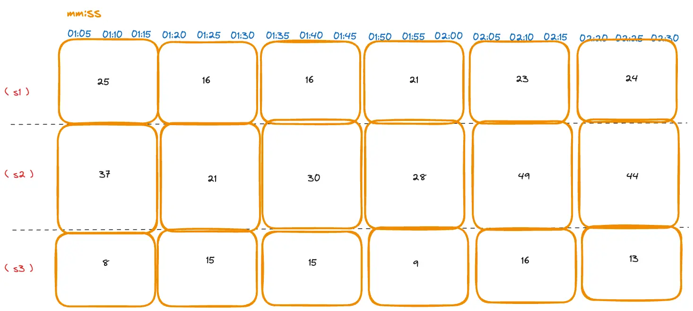

Thêm VD sử dụng query thực tế:

Panel thể hiện network usage (packet/s):

- Biến: system.network.packets là data dạng counter, đếm số lượng packets truyền qua network card của server.

- host.name IN $host.name là filter, dùng để chỉ lấy số liệu từ 1 server nhất định.

- Tổng hợp thời gian: Rate every 60s. VD. Trong 60s, counter packet từ 100 lên 300 thì rate sẽ là (300 - 100)/60 = 3.33 p/s.

- Tổng hợp không gian: Sum by direction, device.

  - direction: gửi đi (transmit) và nhận về (receive)

  - device: tên interface trong network card.

=> thực hiện lấy tổng của các time series có cùng combo direction và device giống nhau.

- Limit 30 là để giới hạn số đường trên biểu đồ phòng trường hợp có quá nhiều interface.

VD2 phức tạp hơn:


query tính CPU load theo thời gian ở trên

Query A:

Biến: system.cpu.time: thời gian cpu chạy.

Filter: host.name IN $host.name: filter metric theo máy host. Nếu dashboard có biến $host.name = duytl-tts.tailca11db.ts.net thì sẽ chỉ lấy metric từ host đó.

Temporal aggregation: Rate - 60 giây 1 lần.

- Vì system.cpu.time là counter tăng liên tục nên phải chuyển thành tốc độ thay đổi (Rate). Ví dụ: idle: 1000 → 1054 trong 60 giây. (1054 - 1000)/60 = 0.9 nghĩa là trong 1 giây, CPU dành 0.9 giây idle => 90% là idle load.

Spatial aggregation: Sum - by state.

- Giả sử CPU có 4 core: cpu0 idle = 0.92, cpu1 idle = 0.90, cpu2 idle = 0.91, cpu3 idle = 0.89 sẽ được cộng lại thành idle = 3.62. Tương tự với các state khác như user, system...

Legend: {{state}} hiển thị các trạng thái idle, user, system, interrupt trên biểu đồ.

Query B:

Gần giống query A nhưng spatial aggregation: Sum - by everything. Có nghĩa là sẽ gộp tất cả các CPU time lại thành 1 đường duy nhất.

Formula F1

A/B: thực hiện chia tổng của rate CPU time phân theo state với tổng của tổng rate CPU time. Ví dụ: sau khi rate: idle = 3.60, user = 0.28, system = 0.12, interrupt = 0.00. Tổng là 4.00 thì kết quả sẽ là idle = 90%, user là 7%, system là 3% và interrupt là 0%.
