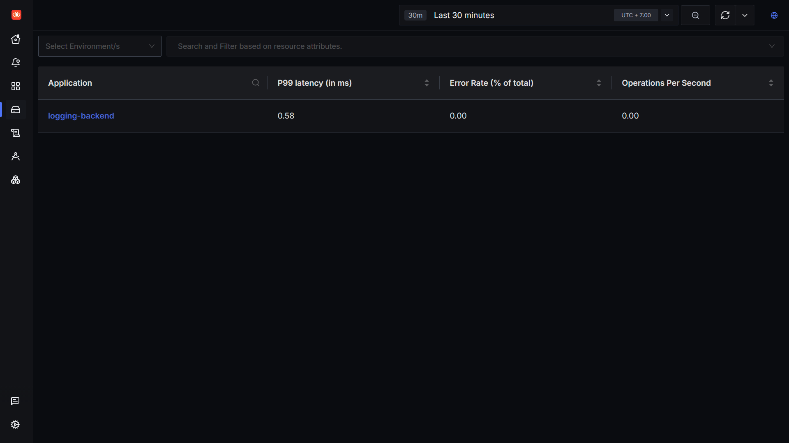
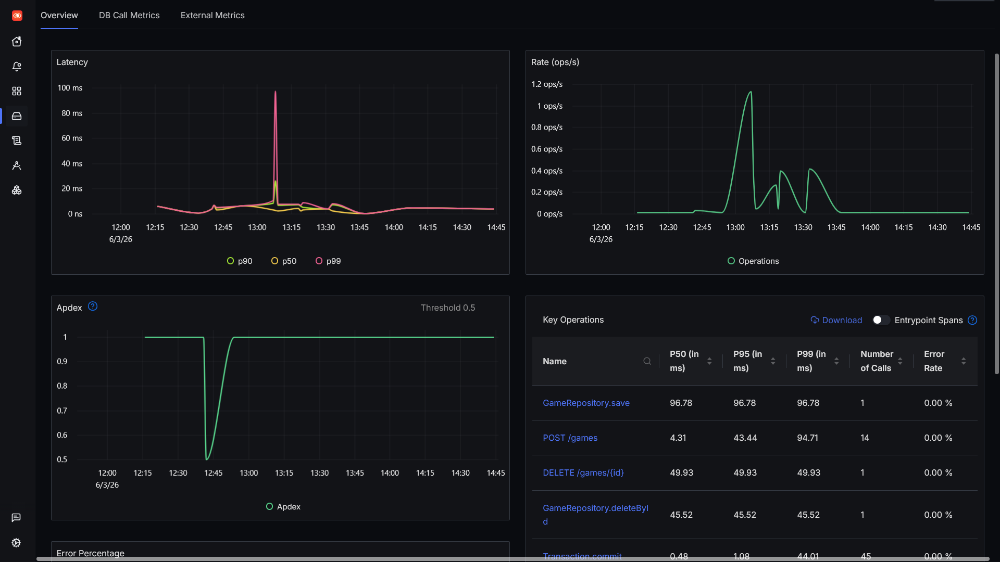
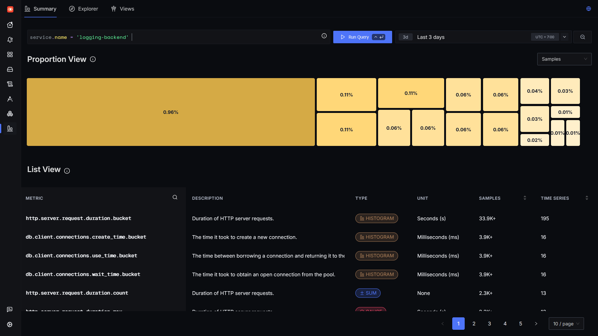
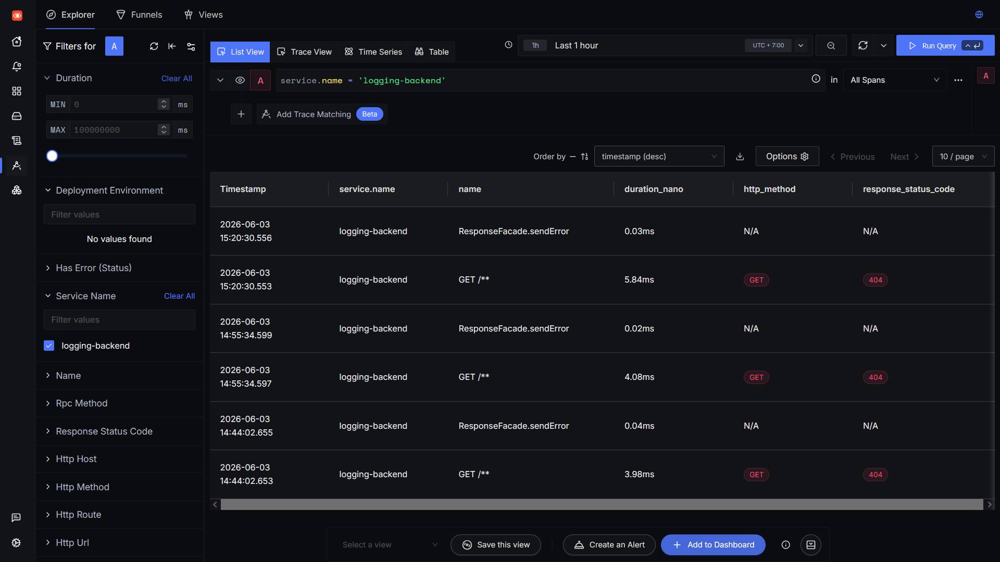
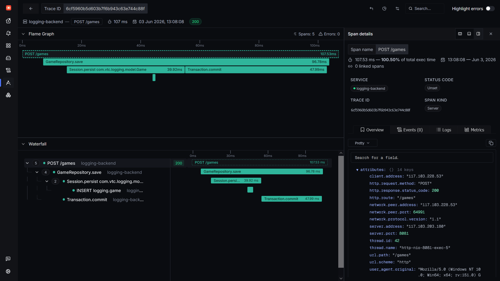
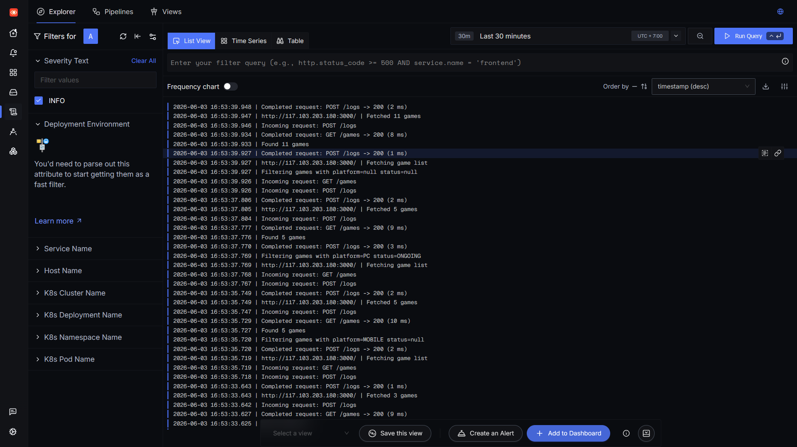
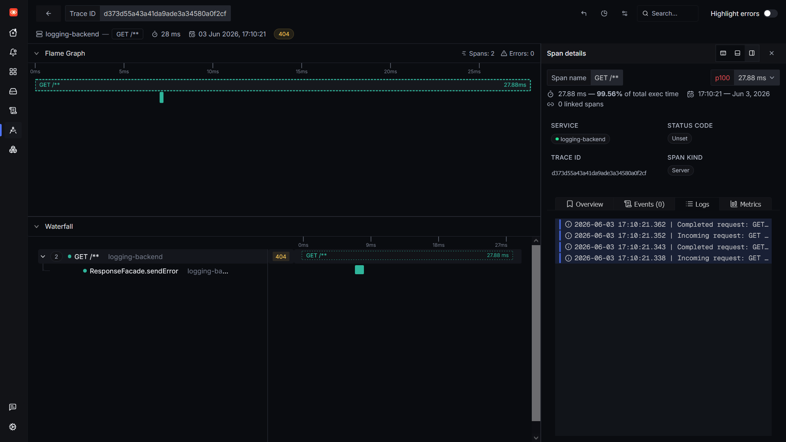

<h1 align="center">Sử dụng SigNoz để monitor và observe ứng dụng</h1>

Ngoài việc sử dụng SigNoz để monitor metric của hệ thống, nền tảng cũng có thể được sử dụng để observe các ứng dụng và service web. SigNoz sử dụng OpenTelemetry để lấy các metric, trace và log của ứng dụng và gửi tới webhook của SigNoz.

Ứng dụng web sử dụng là một chương trình đơn giản có BE Spring Boot, FE React và DB là MySQL. Đối với chương trình Spring Boot và Java, cách đơn giản nhất để thu thập dữ liệu là sử dụng OpenTelemetry Java agent. Agent có thể xử lý hầu hết các thư viện và framework phổ biến, tự động detect API call, service được gọi, DB call, các lỗi... mà không cần người dùng phải sửa trực tiếp vào code.

Thực hiện cài đặt và setup OpenTelemetry Java agent:

**Chạy chương trình trong docker**

Trong dockerfile của BE, thực hiện cài đặt agent:

```
ADD https://github.com/open-telemetry/opentelemetry-java-instrumentation/releases/latest/download/opentelemetry-javaagent.jar /app/opentelemetry-javaagent.jar
```

và thêm các biến môi trường

```
ENV OTEL_SERVICE_NAME="<service_name>"
ENV OTEL_EXPORTER_OTLP_ENDPOINT="http://<endpoint>:4317"
ENV OTEL_EXPORTER_OTLP_PROTOCOL="grpc"
ENV OTEL_METRICS_EXPORTER="otlp"
ENV OTEL_TRACES_EXPORTER="otlp"
ENV OTEL_LOGS_EXPORTER="otlp"
```

rồi chỉnh sửa entrypoint:

```
ENTRYPOINT ["java", "-javaagent:/app/opentelemetry-javaagent.jar", "-jar", "app.jar"]
```

Build và chạy:

```
docker build -t my-java-app .
docker run -p <port>:<port> my-java-app
```

Nếu sử dụng docker compose, có thể để các biến môi trường trong file compose như VD sau: [Dockerfile](/files/Dockerfile) và [docker-compose.yml](/files/docker-compose.yml)

Note: một số lưu ý để kiểm tra OpenTelemetry:

- Kiểm tra xem docker build có tải được agent hay ko:

```
docker exec -it <backend_container> sh
ls -l /app/opentelemetry-javaagent.jar
```

- Kiểm tra logs của otel:

```
docker logs <backend_container>
```

và tìm dòng chứa opentelemetry.

Nếu đã setup và chạy ứng dụng thành công, có thể vào SigNoz, mục Service và sẽ thấy ứng dụng cần monitor hiện lên cùng tên với service name đã set trong biến môi trường lúc trước.



Click vào application để hiển thị các thông số cơ bản của ứng dụng:



- Latency: độ trễ khi thao tác trong BE.

- Rate (op/s): tần suất hoạt động trong ứng dụng.

- Apdex: mức độ hài lòng với thời gian phản hồi của web.

- Error percentage: tỉ lệ lỗi.

- Bảng key operation hiển thị những hoạt động chính xảy ra trong ứng dụng như API call, DB call, service call... Những thông số được hiển thị là latency percentile, số lần call và error rate.

    - Latency percentile Là tỉ lệ mà một thời gian trễ xảy ra. P50 có thể hiểu là một nửa người dùng sẽ trải nghiệm tốc độ này, P95 là 5% người dùng còn P99 là 1% người dùng.

Sau khi đã confirm SigNoz đã nhận được datasource bình thường, có thể vào tab metric và trace để kiểm tra hoạt động của ứng dụng.





Trace cho biết chính xác hoạt động và hành trình của hệ thống khi thực hiện một request. Nội dung của trace được biểu thị dưới dạng một biểu đồ Gantt:



- API được request kèm thời gian bắt đầu và kết thúc.

- Những service được gọi.

- Từ bảng có thể phát hiện được những vấn đề như nghẽn ở đâu, bất đối xứng như thế nào.

Log cũng có thể gửi tương tự như trace và metric nhưng cần phải setup logging trong ứng dụng trước. Trong BE Spring Boot thì phương pháp logging phổ biến nhất là sử dụng log4j. Để SigNoz có thể liên kết các trace với log, cần có trace id trong đoạn log. Một ví dụ sử dụng logback là [logback-spring.xml](files/logback-spring.xml). Sau khi setup log thành công:



Khi xem các trace, có thể kiểm tra những đoạn log đi kèm với trace đó

