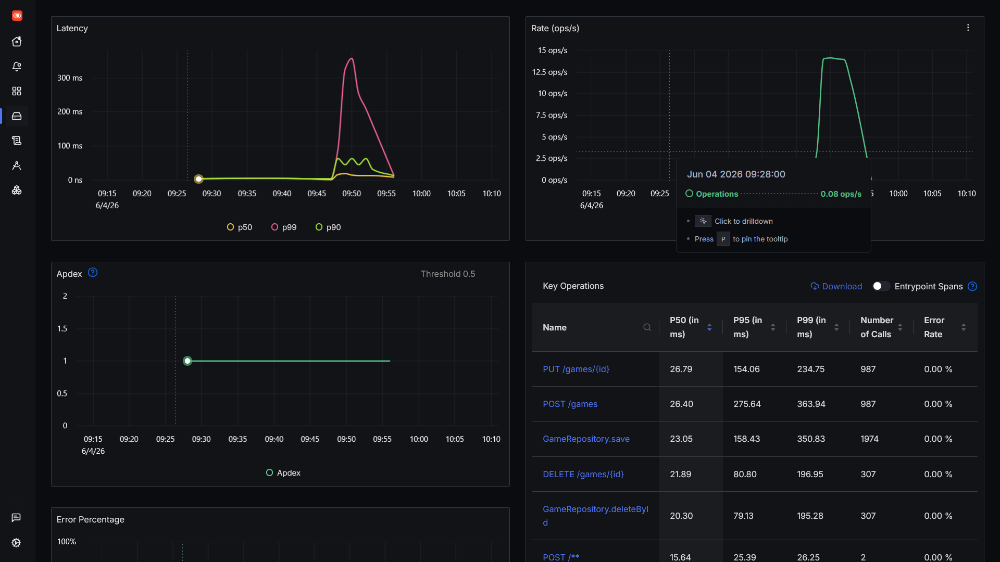

**Tạo traffic tự động cho backend**

Để thực hiện stress test hệ thống và lấy thêm dữ liệu cho SigNoz, cần sử dụng những công cụ thực hiện call API tự động để mô phỏng traffic của một website. Một số phương pháp có thể sử dụng:

1. Script curl: sử dụng một đoạn script thực hiện loop các lệnh curl tới các endpoint trong BE. Dễ chạy, không cần tải các tool khác nhưng không giả lập được các user thật.

2. Sử dụng các tool load-testing như k6: có thể giả lập activity gần giống với user thật, mô phỏng nhiều user cùng sử dụng dịch vụ đồng thời. Để sử dụng tool k6 có thể tải và chạy trực tiếp trên Linux hoặc chạy trong một docker container. Script k6 được sử dụng lần này là [load_test.js](files/load_test.js)

Script sẽ chạy trong 5 phút, mô phỏng activity của 20 user chạy đồng thời, thực hiện các tác vụ CRUD.

Để chạy script trong docker, sử dụng:

```
docker run --rm -i grafana/k6 run - < load_test.js
```

hoặc cài đặt và chạy k6 trực tiếp:

```
sudo apt install k6
k6 run load_test.js
```

Sau khi chạy, kiểm tra các metric và trace để thấy được kết quả:



