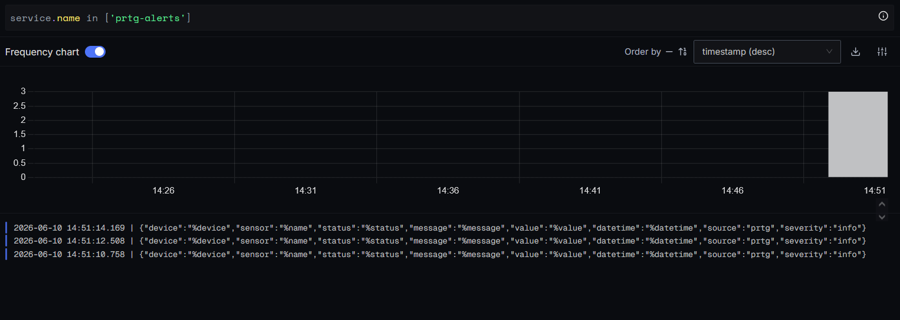

**Thu thập alert của PRTG bằng SigNoz**

Có thể sử dụng OpenTelemetry để thực hiện thu thập alert của PRTG để monitor trong SigNoz.\

Thông thường với các hệ thống monitor khác gửi alert dưới dạng JSON, có thể gửi alert trực tiếp tới endpoint 4317 hoặc 4318 của otel và otel sẽ thực hiện formatting và gửi tới SigNoz nhưng PRTG gửi alert dưới dạng urlencoded nên cần phải có một middleware để format alert sang dạng JSON.

Mô hình: PRTG -> Middleware -> Otel -> SigNoz.

- PRTG sẽ gửi alert tới một endpoint mà middleware expose.

- Middleware thực hiện format alert sang dạng mà otel có thể đọc được là JSON và gửi tới endpoint của otel (4317/4318)

- Otel thực hiện thu thập data và gửi tới SigNoz.

Middleware sử dụng NodeJS + Express [middleware.js](middleware/middleware.js) 

- Thực hiện parse dữ liệu urlencoded sang dạng JSON chuẩn otel.

- Có endpoint để PRTG gửi alert tới tại port 8083.

- http://host.docker.internal:4318/v1/logs do trong hệ thống hiện tại, otel chạy trực tiếp trong server còn middle chạy trong container docker. Có thể chuyển sang sử dụng otel-collector nếu cả 2 cùng nằm trong một network docker hoặc sử dụng địa chỉ IP thực.

- Cần có service.name để có thể lọc ra các alert prtg trong SigNoz theo tên service.

```
attributes: [
    {
        key: "service.name",
        value: { stringValue: "prtg-alerts" }
    }
]
```

Các file khác để chạy container: [docker-compose.yml](middleware/docker-compose.yml), [Dockerfile](middleware/Dockerfile), [package.json](middleware/package.json)

Khi chạy script này, thực hiện gửi notification test ở phía PRTG. Nếu thành công, middleware sẽ format alert và gửi tới container otel collector của SigNoz dưới dạng log:



