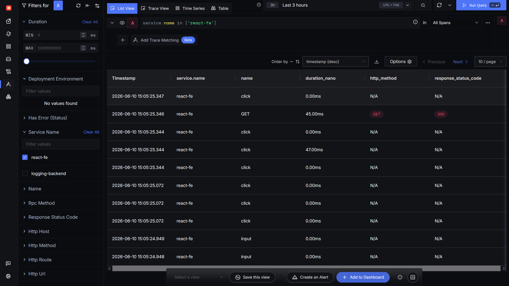
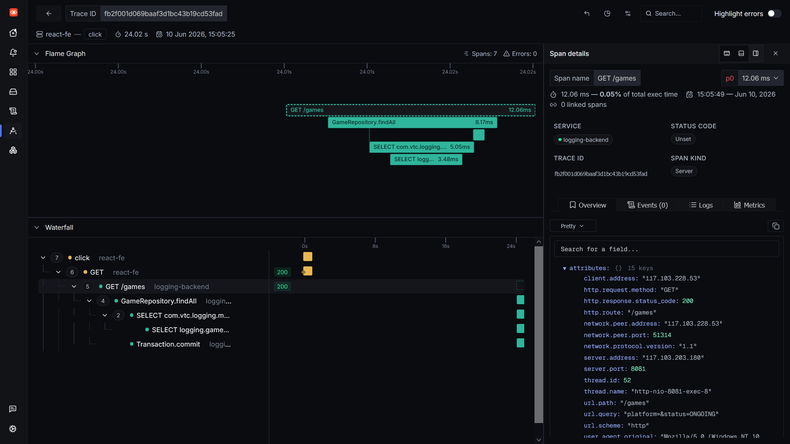
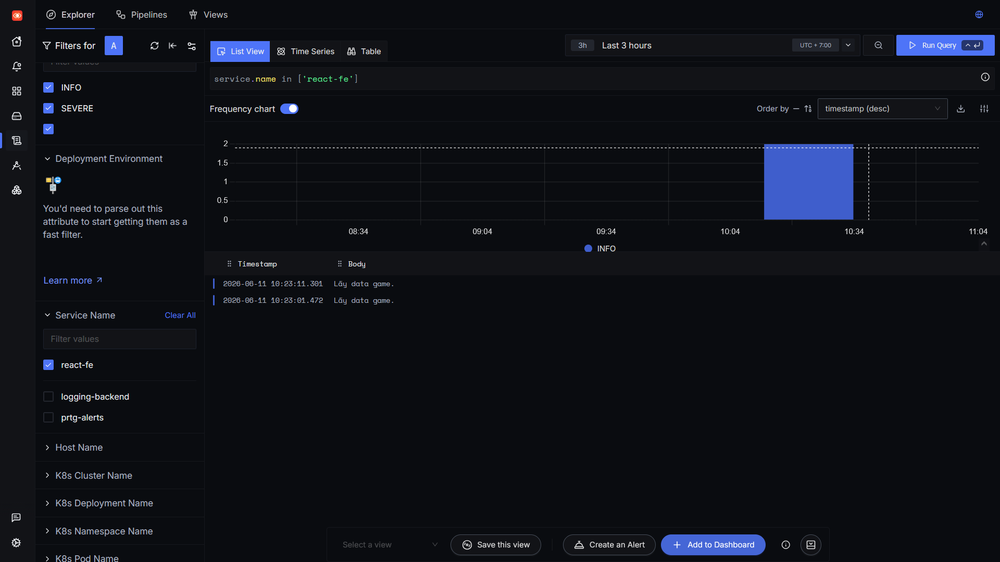
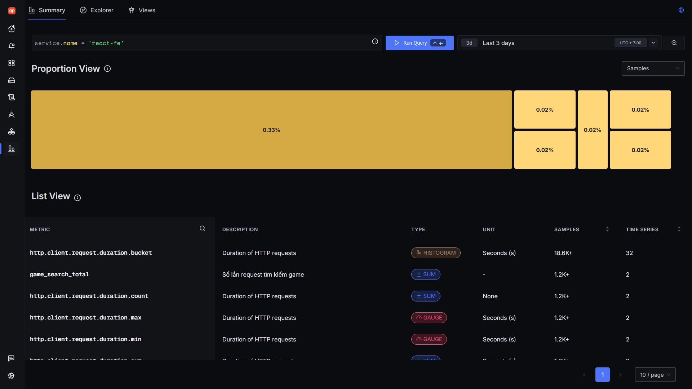
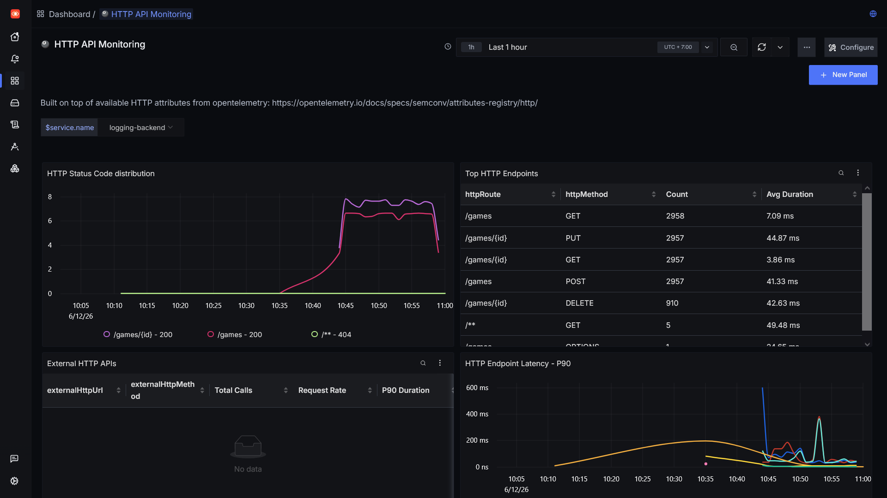
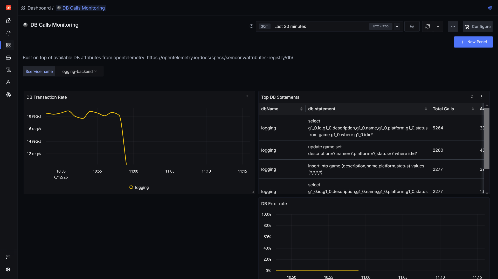
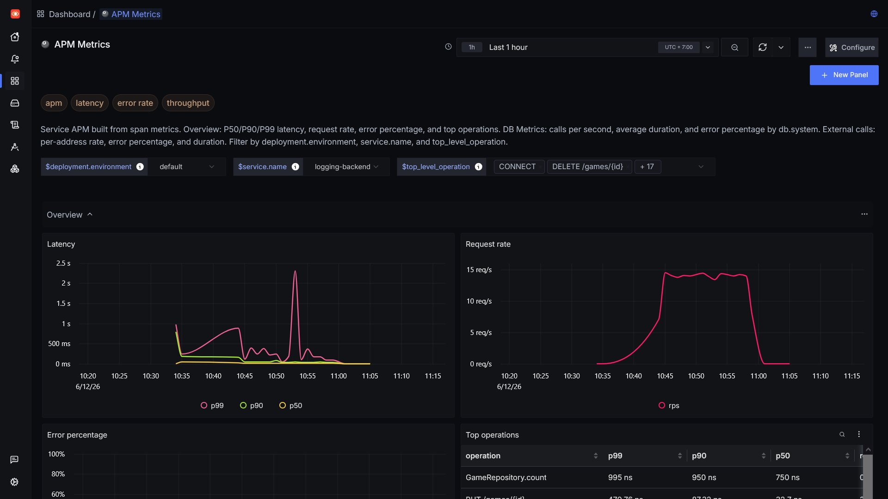

**Đính chính**

Khi thực hiện cài đặt và chạy SigNoz trong Docker, SigNoz sẽ có một otel collector riêng của nó để thực hiện nhận logs, trace và metric. Những tác vụ như thu thập alert từ PRTG hay monitor frontend thì sẽ sử dụng otel collector trong container này. Config của otel collector này nằm tại ~/signoz/deploy/docker/otel-collector-config.yaml.

Khi thực hiện monitor hệ thống, sử dụng một otel collector khác chạy trực tiếp để scrape metric hệ thống. Những metric này được gửi tới endpoint của otel nằm trong container tại port 4317.

**Tracing ở frontend**
Áp dụng với frontend React nhưng những framework frontend khác cũng tương tự, chỉ khác ở cách import file instrumentation vào file top level.

OpenTelemetry và SigNoz cũng có thể được sử dụng để monitor trace ở frontend. Những trace frontend này có thể được liên kết với các trace backend để thực hiện distributed tracing, giúp dễ dàng theo dõi hoạt động của một request xuyên suốt hệ thống.

Thực hiện setup:

Tại directory của project frontend, thực hiện tải các dependency:

```
npm install @opentelemetry/sdk-trace-base
npm install @opentelemetry/sdk-trace-web
npm install @opentelemetry/exporter-trace-otlp-http
npm install @opentelemetry/instrumentation
npm install @opentelemetry/instrumentation-fetch
npm install @opentelemetry/instrumentation-xml-http-request
npm install @opentelemetry/context-zone
npm install @opentelemetry/resources
npm install @opentelemetry/instrumentation-user-interaction
```

Cần một file instrumentation để setup các thành phần sẽ capture trace trong ứng dụng và xuất ra collector. [instrumentation.js](files/instrumentation.js)

- FetchInstrumentation: tự động tạo trace khi FE thực hiện request API sử dụng fetch(). Những trace này sẽ được liên kết với các trace trong backend để tạo thành 1 chuỗi hoạt động hoàn chỉnh.

- XMLHttpRequestInstrumentation: tương tự như trên nhưng dành cho những loại network request cũ hơn, ko sử dụng fetch()

- UserInteractionInstrumentation: track những hoạt động của user trên trang web như click, input trong form, submit...

Sau khi tạo file instrumentation, cần import file này vào file top level trong frontend (VD: index.js).

Nếu đã thực hiện monitor backend sử dụng Otel và SigNoz thì sau khi setup monitor frontend, các trace sẽ tự liên kết với nhau.

Note: SigNoz self host -> cần thêm setting CORS vào trong config otel:

```
receivers:
  otlp:
    protocols:
      grpc:
        endpoint: 0.0.0.0:4317
      http:
        endpoint: 0.0.0.0:4318
        cors:
          allowed_origins:
            - <YOUR_FRONTEND_URL>
          allowed_headers: ['*']
```

Trace FE trong SigNoz:



Cụ thể trace FE và BE liên kết với nhau:



Note: trong file instrumentation, URL trỏ tới otel collector phải dùng IP public hoặc domain public chứ ko sử dụng địa chỉ internal như trong middleware PRTG (http://host.docker.internal:4318) do code JS được chạy trong trình duyệt của user và thực hiện call tới API ngoài.

**Logging ở frontend**

Tương tự như trace, logging và metric cũng có thể được gửi tới otel sử dụng file instrumentation. Nên sử dụng một file instrumentation chung cho cả 3.

Cài đặt các dependency:

```
npm install @opentelemetry/resources
npm install @opentelemetry/sdk-logs
npm install @opentelemetry/exporter-logs-otlp-http
npm install @opentelemetry/api-logs
```

Import các dependency vào instrumentation:

```
import { LoggerProvider, BatchLogRecordProcessor } from '@opentelemetry/sdk-logs'
import { OTLPLogExporter } from '@opentelemetry/exporter-logs-otlp-http'
import { logs } from '@opentelemetry/api-logs'
import { resourceFromAttributes } from '@opentelemetry/resources' // Bỏ nếu đã setup tracing do đã import từ trước
```

Add log exporter:

```
const loggerProvider = new LoggerProvider({
    resource: resourceFromAttributes({
        'service.name': 'react-fe',
    }),
    processors: [
        new BatchLogRecordProcessor(
            new OTLPLogExporter({
                url: 'http://117.103.203.180:4318/v1/logs',
            }),
        ),
    ],
})

logs.setGlobalLoggerProvider(loggerProvider)
```

Sau khi setup file instrumentation, cần setup logging trong ứng dụng. Khác với tracing, cần chỉnh sửa code để log cụ thể. Ví dụ, khi web cần lấy danh sách game:

```
    const fetchGames = async () => {
        try {
            const response = await getAllGames(platform, status)
            setGames(response.data)
            logInfo('Lấy data game.', { platform, status })
        } catch (error) {
            console.log(error)
            logError('Lấy data fail.', { error: error.message})
        }
    }
```

Có thể thấy cần thêm log vào các điểm cụ thể trong ứng dụng. Để có được log này thì trước tiên phải tạo file log utils [log-utils.js](/files/log-utils.js). log utils sẽ cung cấp các loại log có cấp khác nhau như info, warning, error...

Sau khi setup logs thành công, log của fe sẽ hiển thị trong SigNoz như sau:



**Metric ở frontend**

Tương tự như với log và trace, cần cài đặt thêm các dependency:

```
import { MeterProvider, PeriodicExportingMetricReader } from '@opentelemetry/sdk-metrics'
import { OTLPMetricExporter } from '@opentelemetry/exporter-metrics-otlp-http'
import { metrics } from '@opentelemetry/api'
import { resourceFromAttributes } from '@opentelemetry/resources'
```

và thêm thành phần metric provider:

```
const metricReader = new PeriodicExportingMetricReader({
    exporter: new OTLPMetricExporter({
        url: `${OTEL_BASE_URL}/metrics`,
    }),
    exportIntervalMillis: 10000,
})

const myServiceMeterProvider = new MeterProvider({
    resource,
    readers: [metricReader],
})

metrics.setGlobalMeterProvider(myServiceMeterProvider)
```

Tương tự như với logs, nên tạo một file utils riêng chứa những metric muốn log [metric-utils.js](files/metric-utils.js). File utils này dùng để monitor số lần thực hiện action trong FE cũng như response time.

VD thêm metric vào trong ứng dụng:

```
    const fetchGames = async () => {

        const startTime = performance.now()

        try {
            const response = await getAllGames(platform, status)
            setGames(response.data)

            gameSearchCounter.add(1, { platform, status })
            logInfo('Lấy data game.', { platform, status })

            const duration = (performance.now() - startTime) / 1000 // Convert to seconds
            requestDuration.record(duration, {
                'http.request.method': 'GET',
                'http.response.status_code': response.status,
                'http.route': `/games?platform=${platform}&status=${status}`,
                'url.path': `/games?platform=${platform}&status=${status}`,
                'url.scheme': window.location.protocol.replace(':', ''),
            })

        } catch (error) {
            console.log(error)
            errorCounter.add(1, { operation: 'fetchGames' })
            logError('Lấy data fail.', { error: error.message })

            const duration = (performance.now() - startTime) / 1000 // Convert to seconds
            requestDuration.record(duration, {
                'http.request.method': 'GET',
                'http.response.status_code': 0,
                 'http.route': `/games?platform=${platform}&status=${status}`,
                'url.path': `/games?platform=${platform}&status=${status}`,
                'url.scheme': window.location.protocol.replace(':', ''),
            })
        }
    }
```

Nếu setup thành công, metric của FE sẽ hiện trong SigNoz như sau:



**Dashboard cho monitor ứng dụng**

SigNoz cung cấp sẵn 3 loại dashboard là APM Metrics, DB Calls Monitoring và HTTP API Monitoring:

```
https://signoz.io/docs/dashboards/dashboard-templates/apm-metrics/
https://signoz.io/docs/dashboards/dashboard-templates/db-calls-monitoring/
https://signoz.io/docs/dashboards/dashboard-templates/http-api-monitoring/
```

Các dashboard preset này tự động nhận diện service name và giúp người dùng monitor metric ứng dụng, các request từ database và request API HTTP.

Dashboard HTTP API:



Dashboard DB call:



Dashboard APM metrics:




