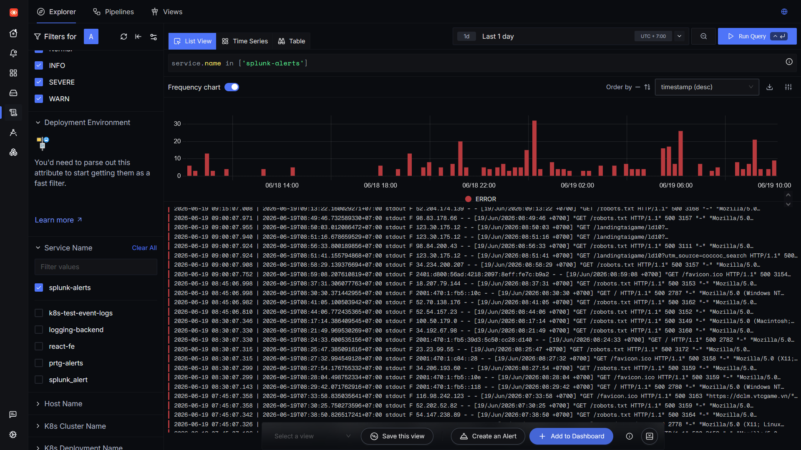
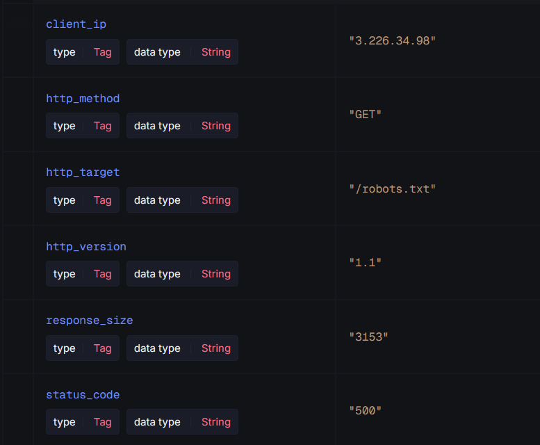

**Nhận log từ các nền tảng monitoring khác**

OpenTelemetry collector của SigNoz có mở sẵn các endpoint để nhận logs, traces và metric là /v1/logs, /v1/traces và /v1/metrics. Các nền tảng khác cần sử dụng endpoint này để gửi data tới SigNoz.

Khi nhận được thành công, có thể tìm kiếm logs của SigNoz như sau:



Logs được gửi tới sẽ được otel tự động chia theo service_name.

**Lọc logs Splunk**

Cần lọc logs của Splunk để lấy ra các thông tin như client IP, status code, http request... Để làm được điều này, có thể sử dụng regex trong config của otel collector để lọc các thông tin này ra thành attribute của log.

Trong config otel, thêm một processor mới:

```
  transform/logs:
    log_statements:
      - context: log
        statements:
          - merge_maps(
              attributes,
              ExtractPatterns(
                body,
                ".*stdout F (?P<client_ip>\\S+) - - \\[[^\\]]+\\] \"(?P<http_method>[A-Z]+) (?P<http_target>[^ ]+) HTTP/(?P<http_version>[0-9.]+)\" (?P<status_code>[0-9]+) (?P<response_size>[0-9]+)"
              ),
              "upsert"
            )
```

Processor này sẽ lọc ra client_ip, http_method, http_target... và đặt chúng thành attribute để có thể thực hiện query trong SigNoz.




