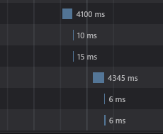
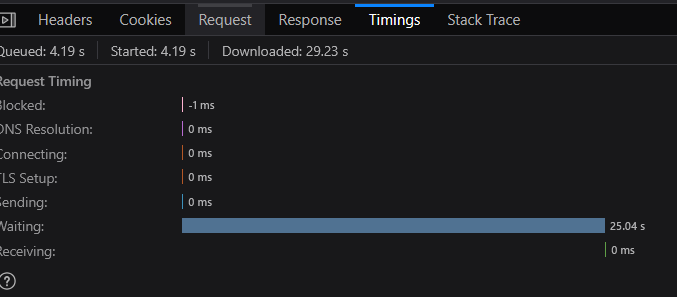

**Ingest log từ file**

Ngoài việc nhận trực tiếp logs từ các endpoint, Otel cũng có thể ingest log từ các file. Để thực hiện ingest từ file, cần thêm một receiver mới vào config tương tự như sau:

```
  filelog:
    include:
      - /logs/*.log
    start_at: beginning
    include_file_path: true
    include_file_name: true
    resource:
      service.name: file-ingest
    operators:
      - type: move
        from: attributes["log.file.path"]
        to: attributes["file.path"]

      - type: move
        from: attributes["log.file.name"]
        to: attributes["file.name"]
```

- Quan trọng là có include và start_at. include trỏ tới địa chỉ path của file log còn start_at trỏ tới nơi mà collector cần bắt đầu đọc log.

- Log khi đọc từ file sẽ ko có các thông tin attribute hay resource, người dùng có thể thêm thông tin này vào trong config otel.

Sau khi thêm receiver này, cần nhớ add nó vào trong pipeline. VD như sau:

```
    logs:
      receivers: [otlp, filelog]
      processors: [transform/logs, batch]
      exporters: [clickhouselogsexporter, metadataexporter, signozmeter]
```

Kết quả ingest log thành công:


Có thể thêm nhiều receiver khác nhau với các setting khác nhau nếu cần ingest log từ nhiều nguồn file khác nhau.

**Test độ chịu tải của SigNoz**

Để test thêm về hiệu năng của SigNoz, sẽ test bằng cách gửi một lượng lớn log và load nó trong SigNoz.

Mốc 1: 1 triệu log. SigNoz vẫn load log ngay tức thì, tốc độ phản hổi của UI không khác so với thông thường.

Mốc 2: 10 triệu log. SigNoz khi load hết log lần đầu cần khoảng 0.5s để load nhưng sau đó thì log sẽ được SigNoz cache lại và những lần load sau sẽ gần như tức thì.

Mốc 3: 100 triệu log. Tương tự như mốc 2 nhưng sẽ mất thời gian hơn một chút.



Cụ thể, khi yêu cầu query hơn 110 triệu log của riêng 1 service, SigNoz sẽ cần khoảng 4 giây.

Ngoài thời gian query kéo dài này thì hệ thống vẫn vận hành bình thường, không có hiện tượng giật lag, UI hoạt động trơn tru.

Kết luận: khả năng chịu tải của SigNoz nhờ sử dụng ClickHouse DB rất tốt, caching data hiệu quả. Thời gian load ngắn và ko ảnh hưởng tới hiệu năng của hệ thống và UI.

**Test SigNoz với lượng data lớn hơn**

Nâng số lượng log lên hơn 700 triệu (khoảng 21GB). Thời gian query log đã nâng lên đáng kể. Query sắp xếp log theo mốc thời gian giảm dần mất 25 giây để load. Ngoài ra thì frontend và hệ thống vẫn hoạt động mượt mà, không có vấn đề gì.




**Retention**

Mặc định thì SigNoz sẽ lưu lại các logs và traces trong 15 ngày và 30 ngày với metrics. Để kéo dài thời gian lưu: Settings -> Workspace Settings.


Khi set thời gian lên cao, SigNoz sẽ càng để dành thêm storage để lưu dữ liệu.

Khi thay đổi thời gian retention thì sẽ chỉ ảnh hưởng tới các dữ liệu sẽ gửi trong tương lại chứ ko áp dụng cho các data đã nhận được. Khi hết thời gian retention, dữ liệu sẽ tự động xóa vĩnh viễn. 

<h1 align="center">Backup và restore</h1>

**Dashboard**

Có thể backup các dashboard bằng cách export ra file json.


Để add các dashboard này từ template: New dashboard -> Import JSON.

**Config OpenTelemetry**

Config của Otel có định dạng yaml, nếu cần backup chỉ cần copy lại. Đối với triển khai trong docker, config Otel của SigNoz thường có tên otel-collector-config.yaml.

**Những dữ liệu còn lại**

Mọi dữ liệu khác của SigNoz, bao gồm trace, log, metric và các dữ liệu như setting, user... đều nằm trong ClickHouse.

Docs cụ thể chi tiết việc backup và restore Clickhouse: https://clickhouse.com/docs/operations/backup/overview

Ví dụ truy cập ClickHouse khi deploy SigNoz trong Docker:

```
docker exec -it signoz-clickhouse clickhouse-client
```

Trong ClickHouse, để thực hiện backup, cần chỉ định một Disk có nhiệm vụ chứa file backup. Disk là một thư mục nhất định được chỉ định trong config của ClickHouse. Để chỉ định các Disk này, cần tạo thêm config cho ClickHouse.

Nên tạo config mới trong cùng directory với các config khác của ClickHouse (thường có địa chỉ là ~/signoz/deploy/common/clickhouse). 

```
<clickhouse>
    <storage_configuration>
        <disks>
            <backups>
                <type>local</type>
                <path>/var/lib/clickhouse/backups/</path>
            </backups>
        </disks>
    </storage_configuration>

    <backups>
        <allowed_disk>backups</allowed_disk>
        <allowed_path>/var/lib/clickhouse/backups/</allowed_path>
    </backups>
</clickhouse>
```

- Config xác định tên Disk sẽ dùng để backup và path của nó. Cụ thể trong config này, path trỏ tới địa chỉ lưu backup trong container của docker.

Sau khi tạo config, cần mount config và thư mục lưu file backup trong máy thực vào trong file compose:

```
    volume:
      - ../common/clickhouse/backup_disk.xml:/etc/clickhouse-server/config.d/backup_disk.xml
      - ./backups:/var/lib/clickhouse/backups
```

Restart compose sau khi thay đổi config. Để kiểm tra xem ClickHouse đã nhận diện Disk backup chưa, truy cập container của clickhouse và chạy:

```
SELECT name, path
FROM system.disks;
```

ClickHouse sẽ liệt kê các disk đã nhận diện. Nếu đã nhận diện disk thành công thì có thể tiến hành backup.

Backup 1 DB:
```
BACKUP DATABASE signoz_traces
TO Disk('backups', 'signoz_traces.zip');
```

Backup nhiều DB:

```
BACKUP DATABASE signoz_logs,
       DATABASE signoz_metrics,
       DATABASE signoz_traces
TO Disk('backups', 'signoz-full.zip');
```

Backup toàn bộ các DB:

```
BACKUP ALL
TO Disk('backups', 'full-backup.zip');
```

Kiểm tra xem đã tạo những backup nào:

```
SELECT *
FROM system.backups;
```

Nếu đã mount thư mục backup trong docker với thư mục backup trong máy thực thành công thì có thể tìm file backup trong thư mục.

Restore 1 DB:

```
RESTORE DATABASE signoz_traces
FROM Disk('backups', 'signoz_traces.zip');
```

Nếu DB đã tồn tại trong ClickHouse thì sẽ ko thể ghi đè được mà sẽ phải drop DB cũ trước khi restore DB mới.

Restore toàn bộ:

```
RESTORE ALL
FROM Disk('backups', 'full-backup.zip');
```