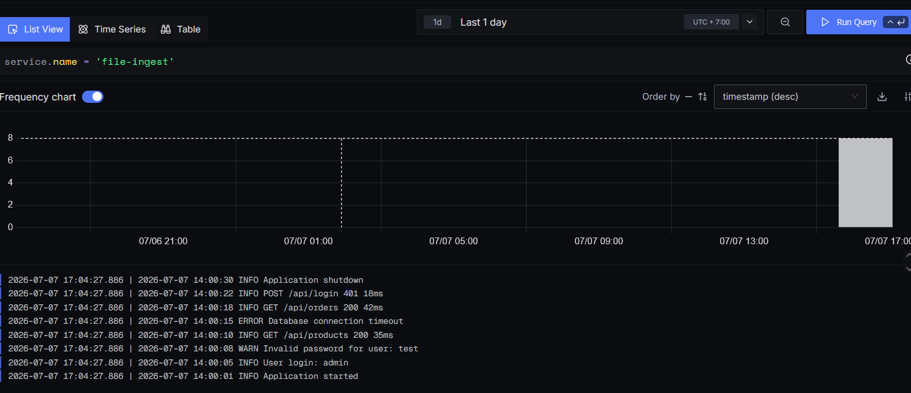
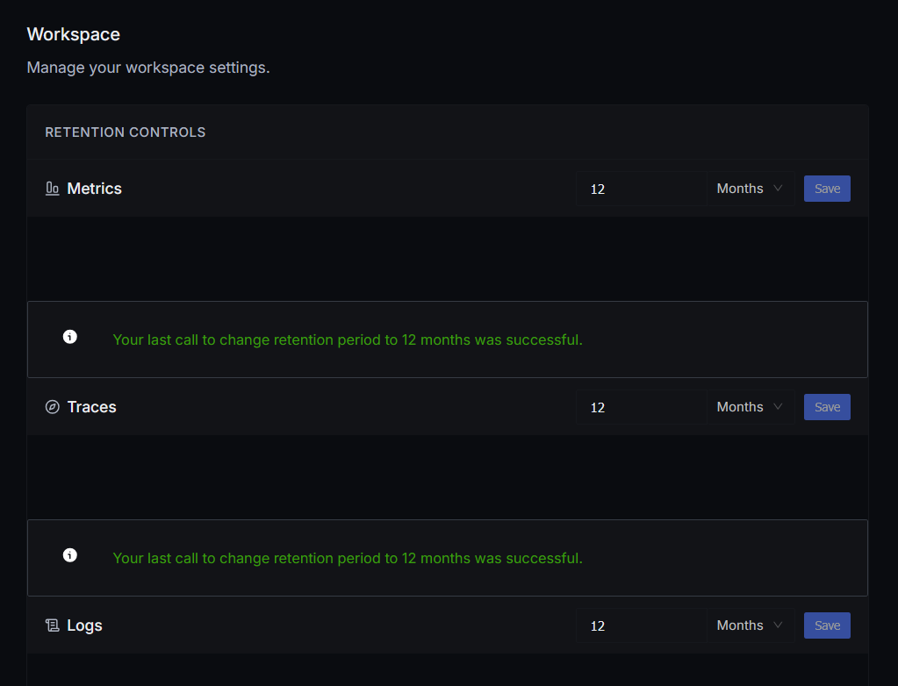
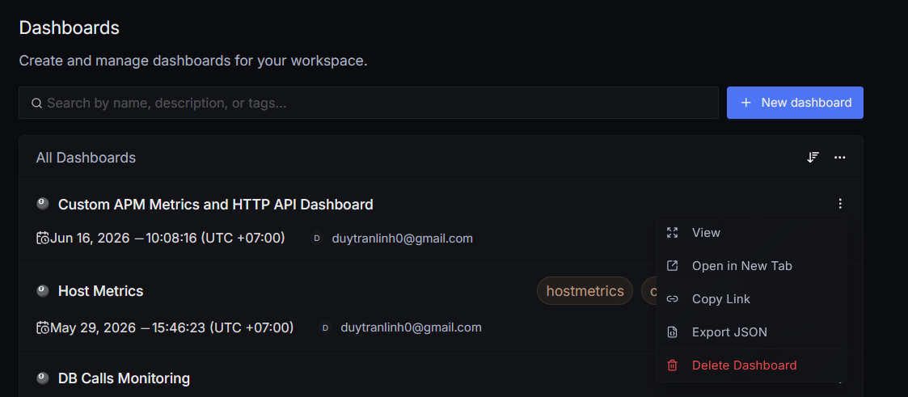

**Ingest log từ file**

Ngoài việc nhận trực tiếp logs từ các endpoint, Otel cũng có thể ingest log từ các file. Để thực hiện ingest từ file, cần thêm một receiver mới vào config tương tự như sau:

```
  filelog:
    include:
      - /logs/*.log
    start_at: beginning
    include_file_path: true
    include_file_name: true
    resource:
      service.name: file-ingest
    operators:
      - type: move
        from: attributes["log.file.path"]
        to: attributes["file.path"]

      - type: move
        from: attributes["log.file.name"]
        to: attributes["file.name"]
```

- Quan trọng là có include và start_at. include trỏ tới địa chỉ path của file log còn start_at trỏ tới nơi mà collector cần bắt đầu đọc log.

- Sau khi thêm receiver này, cần nhớ add nó vào trong pipeline. VD như sau:

```
    logs:
      receivers: [otlp, filelog]
      processors: [transform/logs, batch]
      exporters: [clickhouselogsexporter, metadataexporter, signozmeter]
```

Kết quả ingest log thành công:



**Retention**

Mặc định thì SigNoz sẽ lưu lại các logs và traces trong 15 ngày và 30 ngày với metrics. Để kéo dài thời gian lưu: Settings -> Workspace Settings.



Khi set thời gian lên cao, SigNoz sẽ càng để dành thêm storage để lưu dữ liệu.

Khi thay đổi thời gian retention thì sẽ chỉ ảnh hưởng tới các dữ liệu sẽ gửi trong tương lại chứ ko áp dụng cho các data đã nhận được. Khi hết thời gian retention, dữ liệu sẽ tự động xóa vĩnh viễn. 

<h1 align="center">Backup và restore</h1>

**Dashboard**

Có thể backup các dashboard bằng cách export ra file json.



Để add các dashboard này từ template: New dashboard -> Import JSON.

**Config OpenTelemetry**

Config của Otel có định dạng yaml, nếu cần backup chỉ cần copy lại. Đối với triển khai trong docker, config Otel của SigNoz thường có tên otel-collector-config.yaml.

**Những dữ liệu còn lại**

Mọi dữ liệu khác của SigNoz, bao gồm trace, log, metric và các dữ liệu như setting, user... đều nằm trong ClickHouse.

Docs cụ thể chi tiết việc backup và restore Clickhouse: https://clickhouse.com/docs/operations/backup/overview

Ví dụ truy cập ClickHouse khi deploy SigNoz trong Docker:

```
docker exec -it signoz-clickhouse clickhouse-client
```

Trong ClickHouse, để thực hiện backup, cần chỉ định một Disk có nhiệm vụ chứa file backup. Disk là một thư mục nhất định được chỉ định trong config của ClickHouse.

```
BACKUP DATABASE system TO Disk('backups', 'system.zip');
```