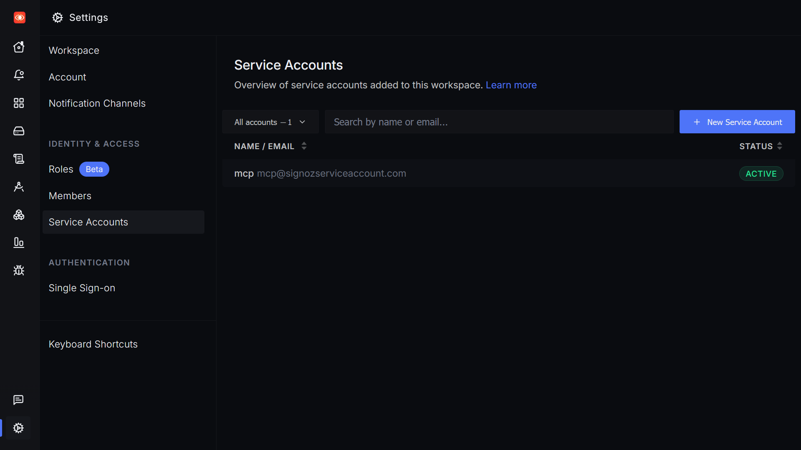
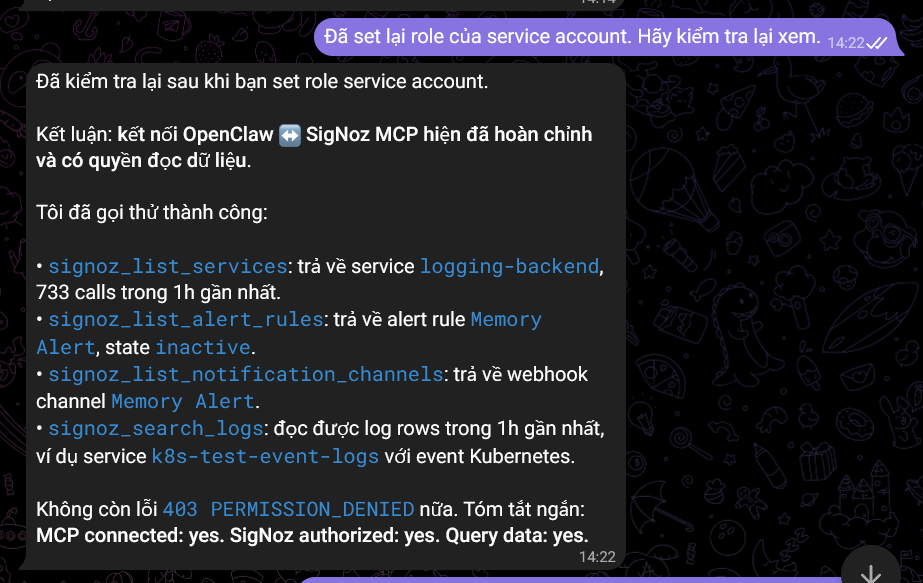
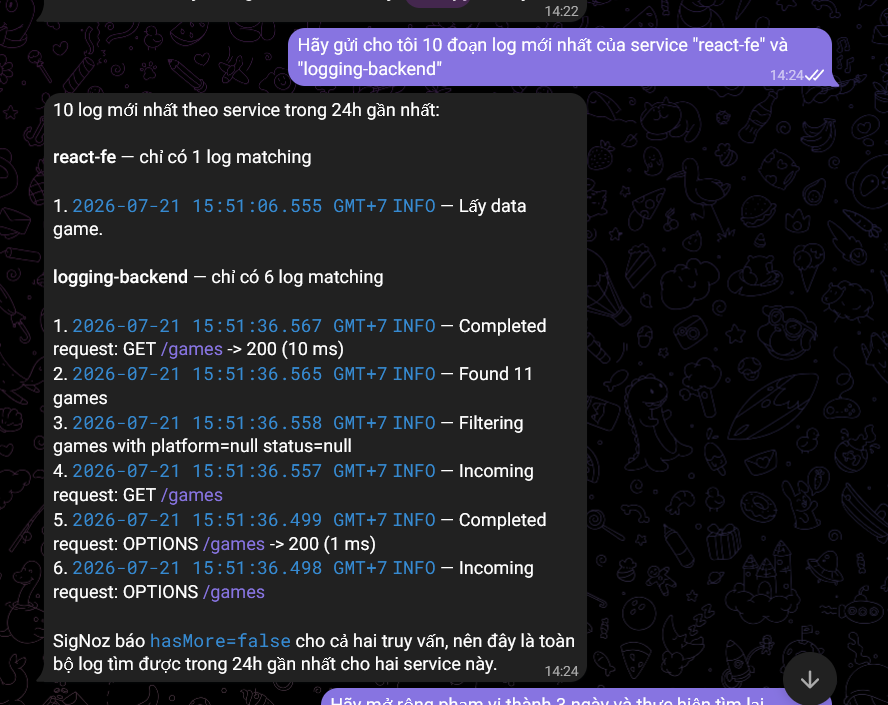

**SigNoz MCP server**

SigNoz MCP server triển khai mô hình MCP (Model context protocol) để các AI agent có thể tương tác với với dữ liệu observability của SigNoz.

Đối với SigNoz self-host, cần chạy server MCP local. Server hỗ trợ 2 mode transport: stdio và HTTP.

Đầu tiên, cần tạo một API key. Đăng nhập vào SigNoz, vào Settings -> Service Account.



Tạo một service account mới, mở tab Keys, tạo key mới và copy key vừa được tạo. 

Trong SigNoz, service account có 4 role:

- signoz-admin: toàn quyền kiểm soát SigNoz.

- signoz-editor: có thể tạo và chỉnh sửa các tài nguyên observability như dashboard, alert, pipeline. Ko có quyền kiểm soát user, role, service account.

- signoz-viewer: chỉ có thể đọc data của SigNoz.

- signoz-anonymous: chỉ có thể đọc data public của SigNoz.

Đối với nhu cầu sử dụng cho AI, nên chọn role signoz-viewer cho service account.

Có 2 cách cài đặt MCP server chính: binary hoặc Docker. Binary:

```
curl -L https://github.com/SigNoz/signoz-mcp-server/releases/latest/download/signoz-mcp-server_linux_amd64.tar.gz | tar xz
```

Docker:

```
docker pull signoz/signoz-mcp-server:latest
```

Sau khi pull image, chạy trong HTTP mode:

```
docker run -p 8000:8000 \
  -e TRANSPORT_MODE=http \
  -e MCP_SERVER_PORT=8000 \
  -e SIGNOZ_URL=<your-signoz-url> \
  -e SIGNOZ_API_KEY=<your-api-key> \
  signoz/signoz-mcp-server:latest
```

- `<your-signoz-url>`: Đường dẫn tới SigNoz instance.
- `<your-api-key>`: API key vừa tạo.

**Kết nối AI agent (MCP client) tới MCP server**

SigNoz có hướng dẫn kết nối cụ thể cho những trợ lý AI tiêu biểu như Cursor, Github Copilot, Claude, Codex... Để kết nối với MCP server, có thể kết nói qua Stdio hoặc HTTP.

**Claude Desktop**

- Stdio: vào Settings -> Developer -> Edit config và thêm đoạn sau vào claude_desktop_config.json:

```
{
  "mcpServers": {
    "signoz": {
      "command": "<path-to-binary>/signoz-mcp-server",
      "args": [],
      "env": {
        "SIGNOZ_URL": "<your-signoz-url>",
        "SIGNOZ_API_KEY": "<your-api-key>",
        "LOG_LEVEL": "info"
      }
    }
  }
}

```

`<path-to-binary>`: Đường dẫn absolute tới binary signoz-mcp-server 

`<your-signoz-url>`: URL của SigNoz

`<your-api-key>`: API key vừa tạo

- HTTP: chạy MCP server trong mode HTTP bằng Docker hoặc chay binary trực tiếp:

```
SIGNOZ_URL=<your-signoz-url> \
SIGNOZ_API_KEY=<your-api-key> \
TRANSPORT_MODE=http \
MCP_SERVER_PORT=8000 \
LOG_LEVEL=info \
./signoz-mcp-server
```

rồi thêm vào claude_desktop_config.json:

```
{
  "mcpServers": {
    "signoz": {
      "url": "http://localhost:8000/mcp"
    }
  }
}
```

Những trợ lý AI khác cx tương tự như vậy. Cụ thể cho các trợ lý khác: https://signoz.io/docs/ai%252Fsignoz-mcp-server

**Thực hiện kết nối bằng OpenClaw chạy Codex**

Tương tự như các trợ lý AI trên, AI agent như OpenClaw cũng có thể kết nối tới MCP server của SigNoz qua 2 đường là Stdio và HTTP.

Command để add MCP server vào OpenClaw:

```
openclaw mcp set <tên-server> <server-info>
```

- Phần server-info cần phải ở dạng json

**Stdio**

Để kết nối với server qua Stdio, cần add server vào OpenClaw như sau:

```
openclaw mcp set signoz {
  "signoz": {
    "command": "/root/.local/bin/signoz-mcp-server",
    "args": [],
    "env": {
      "SIGNOZ_URL": "<signoz-url>",
      "SIGNOZ_API_KEY": "api-key",
      "LOG_LEVEL": "info"
    }
  }
}
```

- command sẽ trỏ tới path của binary signoz-mcp-server

- SIGNOZ_URL là URL của SigNoz (ở port 8080, ko phải URL HTTP của MCP server)

- SIGNOZ_API_KEY là API key vừa tạo.

**HTTP**

Cần kết nối OpenClaw tới endpoint của MCP server đang chạy ở mode HTTP:

```
openclaw mcp set signoz '{"url":"<MCP-server-url>","transport":"streamable-http"}'
```

Một số command hữu ích khác khi làm việc với MCP trong OpenClaw:

Show danh sách MCP server đã thêm vào trong OpenClaw

```
openclaw mcp list
```

Show cụ thể thông tin các server đã add vào trong config

```
openclaw mcp show
```

Sau khi setup MCP server thành công, thực hiện chat trong kênh của OpenClaw để kiểm tra:



Nếu đã thành công và OpenClaw xác nhận đã access được MCP server và có thể sử dụng các tool của SigNoz, có thể thực hiện hỏi đáp OpenClaw về các data observability như sau:


